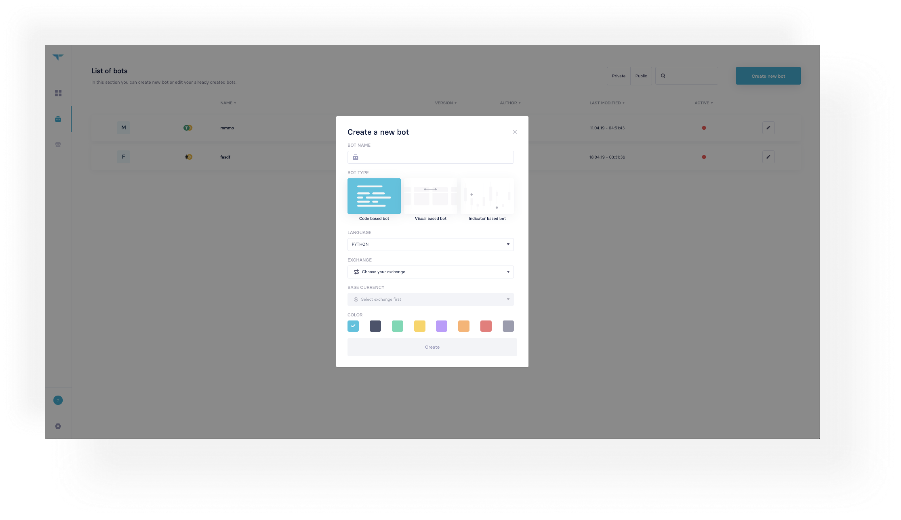
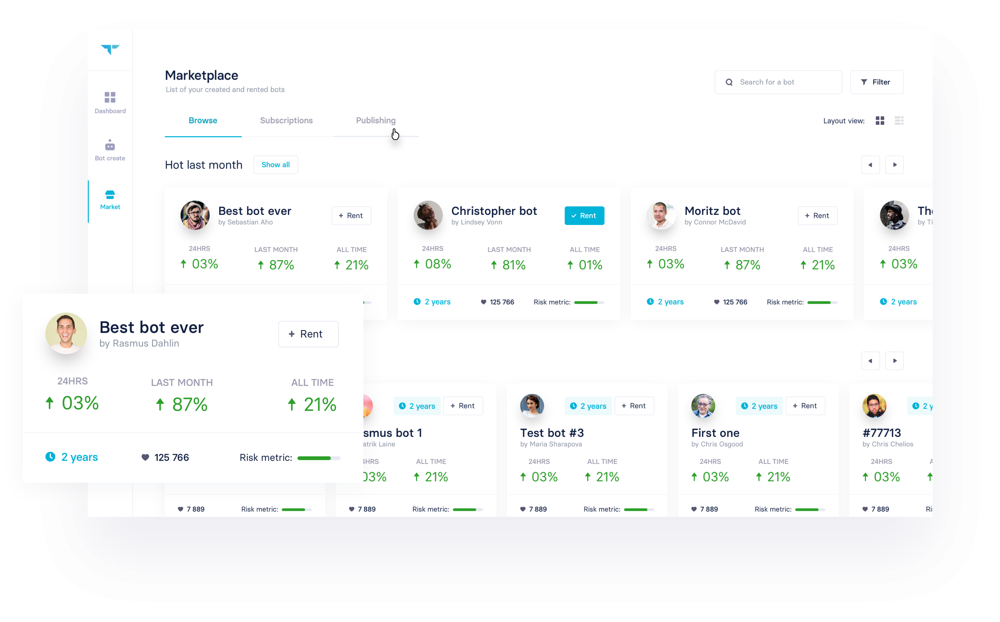

# We got Big Plans

### A first view on the product development roadmap of Trality.

Ok, here it comes: Trality’s first ever Medium story. I want to kick things off on this channel by giving you an “exclusive” glimpse at the roadmap we have set out for developing Trality over the coming months. But first, for all the new Trality followers, let me start off by giving you a short recap of what Trality is all about — our 5-sentence pitch if you will:

**Trality brings together creators and followers of trading bots, enabling them to continuously beat the market with algorithmic trading.
While studies show that up to 90% of Wall Street trading is done by algorithms, such algorithmic trading has remained largely absent from private investing — mostly because setup and maintenance of trading bots, which are used to execute the algorithms, are complex and time-consuming. Trality changes this by offering a one-stop shop for trading bots, which caters both to bot creators, who want to develop high-performing algorithms as well as followers, who lack experience and/or time to do so.
Specifically, on the one hand, the Trality Bot Creator provides creators (and everyone who wants to become one) with all the tools needed to develop professional trading bots. On the other hand, the Trality Bot Marketplace lets followers rent created bots while providing its creator with the opportunity to earn a risk-free side income.**

## So what’s our magic sauce?

While Trality is not the first ever platform for trading bots, none of the few existing competitors speaks to people who really like to dive deep into algorithms and are able build the most sophisticated trading bots: quants, mathematicians, statisticians or simply people who love quantitative problem solving. Instead, they offer a set of standard indicators, some wheels and sliders to adjust parameters and a rudimentary form of backtesting. **This is where Trality picks off**. On our platform, you can make the most of our sophisticated Bot Creator. It supports multiple coding languages, blazing-fast backtesting with detailed data as well as several proprietary machine learning-based elements aimed at increasing bot profitability. The icing on the cake: by offering a Bot Marketplace, we not only provide bot creators with an opportunity to earn a risk-free side income, we are also able to make the aforementioned sophistication of the Bot Creator available to the leisure trader.

## Where are we now?

A lot has happened since we first started developing the platform last summer. As of the beginning of April, we can proudly say that we have evolved to private Beta stage. [Lean-startup](http://theleanstartup.com/principles) aficionados will know that, unless you’re swimming in money, the idea at this point of product development is to release a minimum viable product (MVP) with a limited feature set in order to minimize the risk of significant sunk costs. Hence, we decided concentrate on the most important part of Trality’s selling proposition: the Trality Bot Creator. Specifically, the MVP comprises of:
-a **code-based Bot Creator** supporting Python as it is one of the main languages in the field of data science
-a **virtual trading connection** only in the first months of the Beta phase as trading with real assets early on might entail risks -**backtesting** with a complete set of Binance financial data and pre-defined scenarios of various market conditions and length
-a **dashboard** to monitor virtual trading of all bots
-all relevant **settings and base functionality** for the above-mentioned features

Our aim with this MVP is to **complete the private Beta phase by the end of May.**
We will subsequently start a limited phase of exclusive beta access to our early users and will commence the **full-on public beta by mid June**. Importantly, we have not yet decided when to stop virtual trading only mode and start real trading as this depends on the reliability of our backend. It goes without saying that the plan is to do so asap. The main goal is to **complete the public Beta phase by the end of summer.**

## Where do we go?

Ok, obviously there is a gap between the grand vision, which I outlined in the first paragraphs and our MVP. So when do we tackle the other cool features we have in stock?
The earliest new feature to be developed is other methods of bot creation besides a purely code-based one. While this deviates somewhat from the above-mentioned strategy to focus on sophisticated algorithm creation, it is no less important because it acts as a stepping stone for people, who might not be fluent in Python yet but still want to access the world of high-performing trading bots. We will therefore introduce an indicator-based Bot Creator as soon as possible and moreover plan to introduce a third, awesome method later down the line. **Launch of the indicator-based Bot Creator is scheduled for June.**

## What will the future bring?

Of course, we have many more features planned for Trality, such as ML-based bot creation elements aimed at improving trading performance as well as venturing into the traditional asset markets but these are topics for the near future. As of now we want to focus our limited resources on bringing our customers the best possible product as soon as possible.

### Quick Summary:

-\*April:** we started private Beta with limited feature range (minimum viable product) for extensive user testing -**End of May:** we complete the private Beta -**June:** we offer exclusive Beta access to the Trality Bot Creator for early users -**Mid June:** we start the public Beta of the Trality Bot Creator -**July:** we start the public Beta of the Trality Bot Marketplace -**End of Summer:\*\* we complete the public Beta

That’s all for now, I hope this update made our plans a bit clearer for you and I hope you enjoyed reading it. Lastly, if you have experience in coding python-based trading algorithms and want to **become a private Beta tester** as well, contact us at hello[]trality.com. Thanks! ✌️
